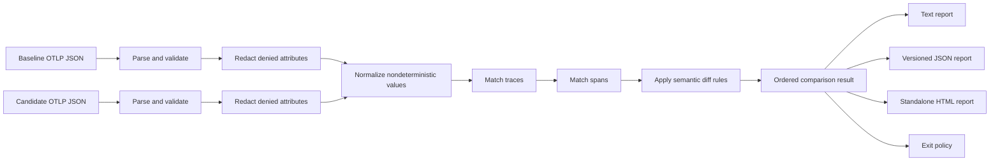

# Architecture

## Purpose and current boundary

TraceDelta is a local command-line program that compares two OpenTelemetry trace exports and produces an ordered set of behavioral findings. The intended pipeline is parse, normalize, match, diff, and report. The current vertical slice implements the smallest useful form of that pipeline for a documented OTLP JSON subset and retains the original synthetic inputs as compatibility fixtures; sections below label behavior that is still proposed.

TraceDelta currently owns:

- reading two explicitly named local files;
- validating and translating supported JSON into domain values;
- comparing supported spans under a configured duration threshold;
- rendering results; and
- selecting a documented process exit code.

TraceDelta does not collect telemetry, run applications, call an OpenTelemetry backend, access source hosting, or send data over the network. A database and hosted control plane are outside the v0.1 boundary.

## Data flow

Normalization produces a deterministic trace-preserving projection, trace and span matching pair normalized operations one-to-one or fail explicitly on unresolved ambiguity, and text, JSON, and standalone HTML reporters consume the same ordered result. The reusable composite Action builds the source selected by its pinned Action ref and orchestrates the local CLI without adding a network or collection path.

## Package responsibilities

- `cmd/tracedelta` owns process concerns: command/flag parsing, standard streams, and exit codes. It should contain no comparison rules.
- `pkg/tracedelta` is the public orchestration boundary. It coordinates a comparison without exposing internal wire-format details.
- `internal/model` contains typed domain values such as traces, spans, recursive attribute values, resource/scope context, status, comparison results, and changes.
- `internal/otlp` decodes the supported OTLP JSON subset, validates required span fields, and translates wire values into domain values.
- `internal/redact` deep-copies parsed snapshots and recursively removes built-in or caller-denied attributes before evidence construction.
- `internal/normalize` removes raw identifiers and absolute clocks, resolves parent relationships, canonicalizes trace/span order and selected typed attributes, and applies an explicit duration bucket before matching.
- `internal/match` establishes one-to-one trace and span correspondence, records non-sensitive evidence, uses matched-parent context plus deterministic sibling order, preserves unique spans across relationship changes, and rejects unresolved ambiguity.
- `internal/diff` produces typed findings from matched, added, and removed domain values, including status transitions and safe `error.type` evidence. It owns threshold semantics, not formatting.
- `internal/report` turns a comparison result into deterministic terminal, schema-versioned JSON, and standalone HTML output from one sanitized model.

Internal packages are deliberate. The wire model and early matching rules will evolve during v0.1 and should not become accidental public APIs. The public package should grow only around demonstrated embedding use cases.

## Core domain types

The architecture revolves around a small set of concepts:

- **Trace**: a related span tree plus resource context, especially service identity.
- **Span**: a named operation with kind, status, duration, parent relationship, resource/scope context, and typed recursive attributes.
- **Match**: an explicit baseline/candidate pair, or an unmatched item on either side, with the evidence used to decide it.
- **Change**: a stable kind such as added, removed, status changed, or duration increased, plus before/after evidence.
- **Comparison result**: ordered changes, summary counts, input labels, and enough policy information for every reporter and the exit decision.

Trace and span identifiers from an export are input correlation data, not stable behavioral identity. Reporters consume comparison results; they do not re-read spans or recompute rules.

## Parse stage

Parsing is strongly typed and fail-fast for unsupported or malformed input. The parser accepts one OTLP/HTTP JSON `ExportTraceServiceRequest` object or a trace-only OTLP File Exporter JSON Lines stream of `TracesData` objects. It traverses multiple records, resource spans, scope spans, traces, and spans; preserves recursive typed attributes plus resource/scope context; accepts canonical numeric kind/status enums; and retains exact timestamp values. The original symbolic enum names remain a documented fixture-compatibility extension. Errors identify the input role (baseline or candidate), record, file operation, and failing field where practical.

OTLP JSON requires receivers to ignore unknown message fields, so safe unknown fields are tolerated at every decoded level. Required span IDs, names, and timestamps are validated rather than replaced with zero values, and trace/span IDs must have the correct nonzero hexadecimal form. Nested `arrayValue` and `kvlistValue` attributes are preserved up to a 64-level depth limit. Events and links are validated, then their payloads are deliberately discarded because v0.1 has no event/link rule; accepted unused data therefore cannot become evidence. JSONL records merge deterministically, record order is not identity, and duplicate spans across records fail contextually. The exact profile is documented under `testdata/`.

Vendor-specific outer envelopes, mixed telemetry types, protobuf-binary input, and exhaustive producer compatibility remain outside v0.1. Recognized metrics, logs, profiles, and common outer wrappers fail actionably instead of silently appearing as empty trace input.

## Normalization stage

Normalization makes supported semantically equivalent runs comparable without changing the parsed snapshot. The current policy:

- resolves each in-trace parent ID before removing all raw trace, span, and parent identifiers;
- preserves parent state as root, a canonical local parent index, or an external parent missing from a partial export;
- rejects self-parenting and parent cycles rather than constructing a misleading tree;
- replaces absolute start timestamps with dense trace-local order ranks, where equal timestamps share a rank;
- sorts sibling subtrees and traces by canonical structural encodings rather than JSON array order;
- floors non-negative durations to an explicitly supplied `time.Duration` bucket, with zero meaning exact duration; and
- projects `http.request.method`, `http.route`, `rpc.method`, and `rpc.service` into lexically sorted typed canonical scalar values.

The duration bucket is available through typed Go orchestration options and defaults to zero, preserving exact duration input before the separate combined diff thresholds. Selected attributes form a stable matching projection only. Before this stage, redaction removes built-in credential/personal-data keys plus caller-supplied exact keys from span/resource/scope and recursive key/value-list data. Deny rules take precedence over the safe set, and a denied `service.name` also clears the derived service field. A string `error.type` is normalized into separate safe error evidence and is deliberately excluded from trace/span identity; non-string forms are treated as missing evidence. Repeated normalization is byte-equivalent for the tested normalized model, including non-finite doubles and bytes, and does not retain `InputOrder`, absolute clock values, raw IDs, status messages, or exception content.

## Matching stage

Matching is a separate stage because correspondence is uncertain, while a diff assumes correspondence is known. The trace matcher groups by normalized root operation, service, kind, and fixed safe attributes; pairs unique exact structures first; and then accepts only mutual unique-best structural-overlap pairs. It records signal categories and overlap counts without copying attribute values into evidence. Status, duration, raw IDs, wall-clock timestamps, and input order are excluded from trace identity. Unresolved trace ties return a typed, non-sensitive ambiguity error.

Within each trace pair, span matching starts with top-level semantic identity and then uses already matched parents to constrain descendants. Repeated siblings use normalized start rank and deterministic order only when distinguishable; an otherwise unique reparented span can match through an explicit fallback. Every candidate is used at most once, unmatched spans remain added/removed, and unresolved duplicate ties return a typed non-sensitive error. See [`trace-matching.md`](trace-matching.md) for the implemented contract.

## Diff stage

Diff rules receive normalized matched or unmatched values and emit typed changes. Current rules detect added spans, removed spans, status transitions, `error.type` changes while both matched spans have `ERROR` status, and candidate duration increases that meet both configured relative and absolute thresholds. Status transitions retain the existing `status BEFORE -> AFTER` finding even when one side carries an error type, avoiding duplicate findings. Error-type evidence distinguishes missing, present-empty, and present values. Latency defaults are `20%` and `10ms`; boundary equality passes, a zero baseline still requires the absolute threshold, and decreases never produce a finding. Duration findings carry their effective thresholds for every reporter.

The v0.1 rule set stops at added spans, removed spans, error-state changes derived from span status plus the safe `error.type` attribute, and latency increases that meet combined relative and absolute thresholds. Error messages and exception stack traces are not evidence. Database operation shapes, general service-call changes, and relationship-change findings are deferred. New rules should be narrow functions until shared behavior demonstrates the need for an interface. Every rule must define stable identity, evidence, ordering, policy effect, and tests for both findings and non-findings.

## Redaction stage

Redaction is a distinct post-parse, pre-normalization stage rather than presentation logic. Before stable attributes can influence matching evidence or findings, built-in credential/personal-data key rules and user-supplied denylisted keys remove entries deterministically. Deny rules take precedence over the fixed safe evidence set. Reporters never receive arbitrary attribute values merely because the parser accepted them. This reduces accidental disclosure but does not claim to anonymize arbitrary telemetry.

## Report and exit stages

Reporting is a pure projection of a comparison result. Stable ordering is part of the user-facing contract because CI output must not fluctuate between runs. Text, `tracedelta.report/v1` JSON, and HTML consume the same ordered sanitized values and result policy. JSON buffers the complete encoded document before writing and escapes control/HTML-significant characters through the standard encoder. HTML likewise buffers one semantic, responsive document, escapes all dynamic content with `html/template`, and includes its CSS inline with no scripts or external assets.

The process adapter maps a successful result with no meaningful differences to `0`, a successful result with differences to `1`, and invalid invocation/input/tool failure to `2`. Reporters do not terminate the process.

## Error handling

- Wrap errors at boundaries with action and input context.
- Preserve underlying errors for programmatic inspection where useful.
- Reject invalid flags and unsupported formats before reading files.
- Do not turn malformed telemetry into an empty successful comparison.
- Keep behavioral differences in the result path; they are not Go errors even though the CLI exits nonzero.
- Send diagnostics to standard error and comparison output either to standard output or the explicitly selected safe output file.

## Extensibility approach

TraceDelta grows by adding data and rules to the existing stages, not by building a plugin framework in advance. Wire parsing remains isolated from domain models; matching remains isolated from diffing; all reporters share one result. Configuration will be a typed value passed explicitly through orchestration rather than global mutable state.

Compatibility-sensitive elements—CLI flags, exit codes, fixture/schema versions, finding kinds, and JSON fields—must be documented and tested before they are treated as stable.

## Test strategy

- Unit tests cover parsing validation, normalization invariants, matching ambiguity, each diff rule, ordering, and reporter escaping.
- Synthetic JSON fixtures cover end-to-end behavior without production or personal data.
- CLI-level tests cover arguments, streams, and exit-code mapping where practical.
- Golden files are appropriate only for deliberate report contracts and must remain reviewable.
- Focused fuzz targets cover untrusted JSON, matching determinism, and reporter escaping when they exercise behavior not already established by table tests.
- Repository validation runs formatting checks, `go test ./...`, `go vet ./...`, and a clean CLI build.

## Deliberately postponed

The v0.1 architecture deliberately avoids a database, web application, remote trace backend, telemetry collector, Kubernetes support, ClickHouse, Docker Compose, source-host API calls from the comparator, AI-generated conclusions, and an extension/plugin runtime. Release automation may publish binaries and checksums, and the reusable Action may download a pinned release asset; neither path receives trace contents from TraceDelta itself. These boundaries are recorded in [ADR 0002](decisions/0002-v0.1-release-boundary.md).
