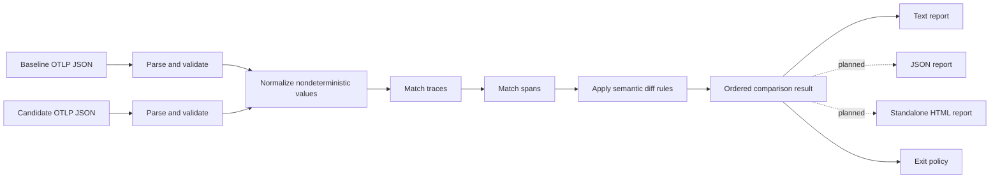

# Architecture

## Purpose and current boundary

TraceDelta is a local command-line program that compares two OpenTelemetry trace exports and produces an ordered set of behavioral findings. The intended pipeline is parse, normalize, match, diff, and report. The initial vertical slice implements the smallest useful form of that pipeline for synthetic, simplified OTLP-compatible JSON; sections below label behavior that is still proposed.

TraceDelta currently owns:

- reading two explicitly named local files;
- validating and translating supported JSON into domain values;
- comparing supported spans under a configured duration threshold;
- rendering results; and
- selecting a documented process exit code.

TraceDelta does not collect telemetry, run applications, call an OpenTelemetry backend, access source hosting, or send data over the network. A database and hosted control plane are outside the v0.1 boundary.

## Data flow

In the initial slice, normalization and trace matching are intentionally minimal, and only text reporting is available. The package boundaries reserve the full flow so each stage can become more capable without coupling parsing to presentation.

## Package responsibilities

- `cmd/tracedelta` owns process concerns: command/flag parsing, standard streams, and exit codes. It should contain no comparison rules.
- `pkg/tracedelta` is the public orchestration boundary. It coordinates a comparison without exposing internal wire-format details.
- `internal/model` contains typed domain values such as traces, spans, status, comparison results, and changes.
- `internal/otlp` decodes supported JSON, validates required fields, and translates wire values into domain values.
- `internal/normalize` removes or buckets nondeterministic fields before matching. Its full policy is planned work.
- `internal/match` establishes one-to-one trace and span correspondence and explains ambiguity. Semantic matching is planned work.
- `internal/diff` produces typed findings from matched, added, and removed domain values. It owns threshold semantics, not formatting.
- `internal/report` turns a comparison result into deterministic output. Text is current; JSON and HTML are planned.

Internal packages are deliberate. The wire model and early matching rules will evolve during v0.1 and should not become accidental public APIs. The public package should grow only around demonstrated embedding use cases.

## Core domain types

The architecture revolves around a small set of concepts:

- **Trace**: a related span tree plus resource context, especially service identity.
- **Span**: a named operation with kind, status, duration, parent relationship, and typed attributes relevant to behavior.
- **Match**: an explicit baseline/candidate pair, or an unmatched item on either side, with the evidence used to decide it.
- **Change**: a stable kind such as added, removed, status changed, or duration increased, plus before/after evidence.
- **Comparison result**: ordered changes, summary counts, input labels, and enough policy information for every reporter and the exit decision.

Trace and span identifiers from an export are input correlation data, not stable behavioral identity. Reporters consume comparison results; they do not re-read spans or recompute rules.

## Parse stage

Parsing is strongly typed and fail-fast for unsupported or malformed input. Errors identify the input role (baseline or candidate), file operation, and failing field where practical. The simplified fixture schema is documented under `testdata/`.

The stronger OTLP parser will need to traverse resource spans, scope spans, traces, and typed attribute values while retaining only data needed by later stages. Unknown fields should be tolerated when safe; invalid required fields should not be silently replaced with zero values.

## Normalization stage

Normalization makes semantically equivalent runs comparable. The planned policy will:

- discard or replace trace and span IDs after relationships are resolved;
- convert timestamps into relative ordering and duration information;
- bucket durations using explicit tolerance;
- canonicalize status and selected semantic-convention attributes;
- retain parent-child structure while removing unstable identifiers; and
- apply attribute allowlists, denylists, and future redaction before reportable evidence is created.

Normalization must be deterministic and non-mutating: the same parsed input and configuration must always produce the same value. The initial slice does not claim full nondeterministic-value normalization.

## Matching stage

Matching is a separate stage because correspondence is uncertain, while a diff assumes correspondence is known. The initial fixture comparison uses its documented exact stable span key and therefore assumes unambiguous synthetic inputs. It does not yet perform general trace matching.

The proposed matcher uses ordered signals and deterministic tie-breaking, records ambiguity instead of guessing, and never uses raw trace/span IDs as cross-run identity. See [`trace-matching.md`](trace-matching.md) for the full proposal.

## Diff stage

Diff rules receive normalized matched or unmatched values and emit typed changes. The initial rules detect added spans, removed spans, status changes, and candidate duration increases that meet the configured relative threshold.

Rules for changed service calls, errors, database operation shapes, relationships, and richer latency policies are planned. New rules should be narrow functions until shared behavior demonstrates the need for an interface. Every rule must define stable identity, evidence, ordering, severity or policy effect, and tests for both findings and non-findings.

## Report and exit stages

Reporting is a pure projection of a comparison result. Stable ordering is part of the user-facing contract because CI output must not fluctuate between runs. Text output is implemented first. JSON will use an explicit schema version, and HTML will be a self-contained escaped document derived from the same result.

The process adapter maps a successful result with no meaningful differences to `0`, a successful result with differences to `1`, and invalid invocation/input/tool failure to `2`. Reporters do not terminate the process.

## Error handling

- Wrap errors at boundaries with action and input context.
- Preserve underlying errors for programmatic inspection where useful.
- Reject invalid flags and unsupported formats before reading files.
- Do not turn malformed telemetry into an empty successful comparison.
- Keep behavioral differences in the result path; they are not Go errors even though the CLI exits nonzero.
- Send diagnostics to standard error and comparison output to standard output.

## Extensibility approach

TraceDelta grows by adding data and rules to the existing stages, not by building a plugin framework in advance. Wire parsing remains isolated from domain models; matching remains isolated from diffing; all reporters share one result. Configuration will be a typed value passed explicitly through orchestration rather than global mutable state.

Compatibility-sensitive elements—CLI flags, exit codes, fixture/schema versions, finding kinds, and JSON fields—must be documented and tested before they are treated as stable.

## Test strategy

- Unit tests cover parsing validation, normalization invariants, matching ambiguity, each diff rule, ordering, and reporter escaping.
- Synthetic JSON fixtures cover end-to-end behavior without production or personal data.
- CLI-level tests cover arguments, streams, and exit-code mapping where practical.
- Golden files are appropriate only for deliberate report contracts and must remain reviewable.
- Fuzzing is a future addition for untrusted JSON and matcher edge cases.
- Repository validation runs formatting checks, `go test ./...`, `go vet ./...`, and a clean CLI build.

## Deliberately postponed

The v0.1 architecture deliberately avoids a database, web application, remote trace backend, telemetry collector, Kubernetes support, ClickHouse, Docker Compose, release automation, source-host API calls, AI-generated conclusions, and an extension/plugin runtime. These would add operational and security surface before local comparison semantics are reliable.
